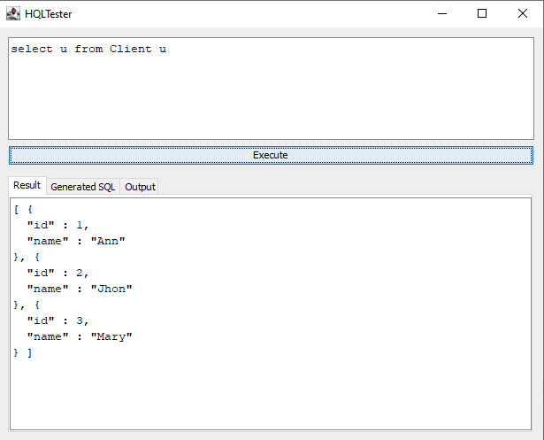

## Disclaimer

This code was not intended to be publish, distributed or to be a library. But some folks told it can be useful to other people, so I publish as I use:    
a single file, which you put in your project, test your HQLs and delete it after.

## How to use

1. Copy **HQLTester.java** to your Spring project.
2. Execute **HQLTester** as java application.
3. Test your HQLs
4. Delete **HQLTester.java** (it was not intended to be part of your Spring Application, can cause undesired effects. Should be used only while you are testing your HQLs).

## Preview

